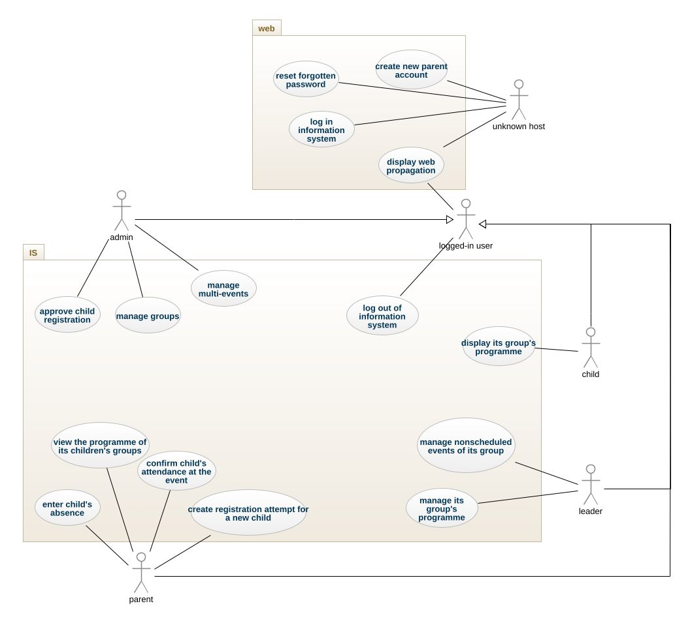
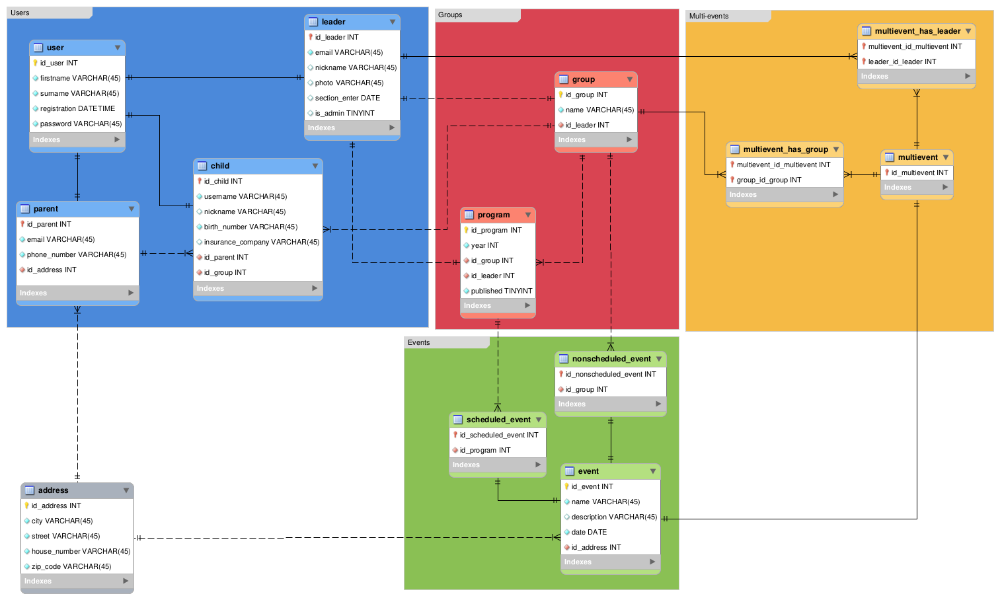

# IS pro oddíl (Oddílový systém)

### Řešitelé
- **Simona Horáčková**
- **Petr Chatrný**
- **Lucie Pacáková**
- **Lucie Suchánková**

### Použité technologie

|                |                                                                                                                                                                                                                                                                                                                                                                                                                                                            |
|----------------|------------------------------------------------------------------------------------------------------------------------------------------------------------------------------------------------------------------------------------------------------------------------------------------------------------------------------------------------------------------------------------------------------------------------------------------------------------|
| Frontend       |    |
| Backend        |                                                                                                                                                                                                                                                                                                                                 |

## Zadání
S kamarády vedeme oddíl dětí. Děti máme rozděleny do skupin po 15. Za každou skupinu zodpovídají 2 vedoucí, kteří tvoří její program. 

Potřebujeme vytvořit systém, který bude informovat rodiče o námi plánovaných akcích. Rodiče mohou mít více dětí, které mohou být v různých skupinách, měli by mít možnost sledovat program odpovídajících skupin. Rodiče by nám měli v případě nemoci nebo jiného důvodu, že se dítě nemůže dostavit, dát pomoci systému vědět, abychom případně nečekali na místě srazu na někoho, kdo nepřijde.

Program pro skupiny může být různý, může se odehrávat buď v našem areálu, nebo může být na různých jiných místech. Místo srazu musí být vždy dopředu v programu. Vedoucí musí mít vždy zveřejněný program minimálně jeden měsíc dopředu. Akce jednotlivých skupin se odehrávají v pravidelných časech každý týden, ale může vzniknout i akce, která je mimo termín. Dokonce může vzniknout akce, která je i pro více skupin. (Příkladem může být letní tábor). Takovouto akci potom řeší více vedoucích. Takovouto akci může založit pouze Administrátor systému a následně přidělit spolupracovníky a skupiny, kterých se tato akce týká. Rodiče vždy musí dopředu účast dětí potvrdit.

Jelikož se snažíme podporovat i IT gramotnost, přístup do systému budou mít i děti. Ty budou moci sledovat program, který je čeká a budou mít k dispozici propozice k jednotlivým akcím. Potřebujeme, aby náš web nesloužil pouze jako informační systém, ale také jako nástroj propagace.

## Případy užití

## Databázový diagram

